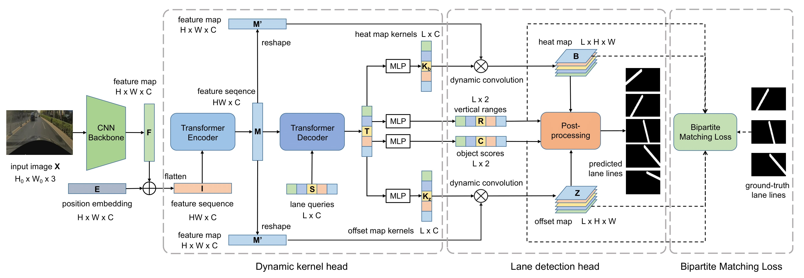

# Generating Dynamic Kernels via Transformers for Lane Detection

In this work, we propose a transformer-based dynamic kernel generation architecture for lane detection. It utilizes a transformer to generate dynamic convolutional kernels for each lane line in the input image, and then detect these lane lines with dynamic convolution.

## Framework
   

## Installation
   1. Create python environment:
      ```
      conda create -n hdmapnet python=3.10
      conda activate hdmapnet
      ```
   2. Install pytorch (>=2.0.0):
      ```
      pip install torch torchvision torchaudio torchdata
      ```
   3. Install mmcv (>=2.0.0):
      ```
      pip install -U openmim
      mim install mmcv
      ```
   4. Install requirements:
      ```
      pip install -r requirements.txt
      ```
   5. Install cuda11.7 (add to your ~/.bashrc and then `source ~/.bashrc`)
      ```
      export CUDA_HOME=/usr/local/cuda-11
      export PATH=$PATH:$CUDA_HOME/bin
      export LD_LIBRARY_PATH=/usr/local/cuda/lib64${LD_LIBRARY_PATH:+:${LD_LIBRARY_PATH}}
      ```

## Prepare Dataset
   1. Put your dataset into `/path/to/datasets/`
   2. Rename the dataset directory with the parameter after `-d`, e.g., `/path/to/datasets/openlane`
   3. A more convenient way is `ln -s /path/to/datasets/original_name /path/to/datasets/openlane`
   4. The directory structure should look like this:
      ```
      /path/to/datasets/
      ├── openlane
      │   ├── images
      │   │   ├── training
      │   │   └── validation
      │   ├── lane3d_1000
      │   │   ├── training
      │   │   ├── validation
      │   │   └── test
      │   │       ├── curve_case
      │   │       ├── merge_split_case
      │   │       └── ...
      │   └── lane3d_3000.tar
      ├── curvelanes
      ├── culane
      └── tusimple
      ```

## Install Evaluation Tools
   1. Install opencv:
      ```
      git clone https://github.com/opencv/opencv.git
      cd ~/opencv
      mkdir build
      cd build
      cmake -D CMAKE_BUILD_TYPE=Release -D CMAKE_INSTALL_PREFIX=/usr/local ..
      make -j7
      sudo make install
      ```
   2. Install openlane evaluation tool:
      ```
      cd /path/to/project/tools/metrics/lane/openlane/lane2d
      # specify your opencv path in ./Makefile#L40,41 (OPENCV_INCLUDE and OPENCV_LIB_PATH)
      make
      ```


## Training & Evaluation
   1. Training debug:
      ```
      python tools/train.py -a CondLSTR2DRes34 -d openlane -v 2d -c 21 -t lane_det_2d --data-dir /path/to/datasets/  --logs-dir /path/to/checkpoint -b 4
      ```
   2. Evaluation debug:
      ```
      python tools/train.py -a CondLSTR2DRes34 -d openlane -v 2d -c 21 -t lane_det_2d --data-dir /path/to/datasets/  --logs-dir /path/to/checkpoint -b 4 --eval
      ```
   3. Test/visualization debug:
      ```
      python tools/test.py -a CondLSTR2DRes34 -d openlane -v 2d -c 21 -t lane_det_2d --data-dir /path/to/datasets/  --logs-dir /path/to/checkpoint --test-dir /path/to/output -b 4
      ```
   4. Multi-gpu training:
      ```
      python -m torch.distributed.launch --nproc_per_node=4 tools/train.py -a CondLSTR2DRes34 -d openlane -v 2d -c 21 -t lane_det_2d --data-dir /path/to/datasets/  --logs-dir /path/to/checkpoint --gpu-ids 0,1,2,3 -b 4
      ```
   5. Multi-gpu evaluation:
      ```
      python -m torch.distributed.launch --nproc_per_node=4 tools/train.py -a CondLSTR2DRes34 -d openlane -v 2d -c 21 -t lane_det_2d --data-dir /path/to/datasets/  --logs-dir /path/to/checkpoint --gpu-ids 0,1,2,3 -b 4 --eval
      ```
   6. Multi-gpu test/visualization:
      ```
      python -m torch.distributed.launch --nproc_per_node=4 tools/test.py -a CondLSTR2DRes34 -d openlane -v 2d -c 21 -t lane_det_2d --data-dir /path/to/datasets/  --logs-dir /path/to/checkpoint --test-dir /path/to/output --gpu-ids 0,1,2,3 -b 4
      ```
   7. Resume from checkpoint:
      ```
      python -m torch.distributed.launch --nproc_per_node=4 tools/train.py -a CondLSTR2DRes34 -d openlane -v 2d -c 21 -t lane_det_2d --data-dir /path/to/datasets/  --logs-dir /path/to/checkpoint --gpu-ids 0,1,2,3 -b 4 --resume
      ```
   8. Training with AMP (Automated Mixed Precision):
      ```
      python -m torch.distributed.launch --nproc_per_node=4 tools/train.py -a CondLSTR2DRes34 -d openlane -v 2d -c 21 -t lane_det_2d --data-dir /path/to/datasets/  --logs-dir /path/to/checkpoint --gpu-ids 0,1,2,3 -b 4 -p amp
      ```
   9. Finetune with a pretrained model (Put its `checkpoint.pth.tar` under `/path/to/checkpoint`):
      ```
      python -m torch.distributed.launch --nproc_per_node=4 tools/train.py -a CondLSTR2DRes34 -d openlane -v 2d -c 21 -t lane_det_2d --data-dir /path/to/datasets/  --logs-dir /path/to/checkpoint --gpu-ids 0,1,2,3 -b 4 --resume --load-model-only
      ```

## Test
   1. OpenLane
      ```
      python -m torch.distributed.launch --nproc_per_node=4 tools/test.py -a CondLSTR2DRes34 -d openlane -v 2d -c 21 -t lane_det_2d --data-dir /path/to/datasets/  --logs-dir /path/to/checkpoint --test-dir /path/to/checkpoint --gpu-ids 0,1,2,3 -b 4
      python tools/metrics/lane/openlane/openlane_2d.py --pred-dir /path/to/output --anno-dir /path/to/datasets/openlane --translate
      ```
   2. CurveLanes

